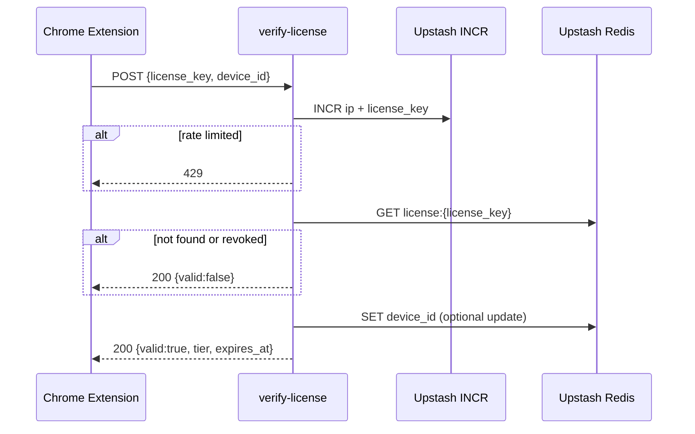
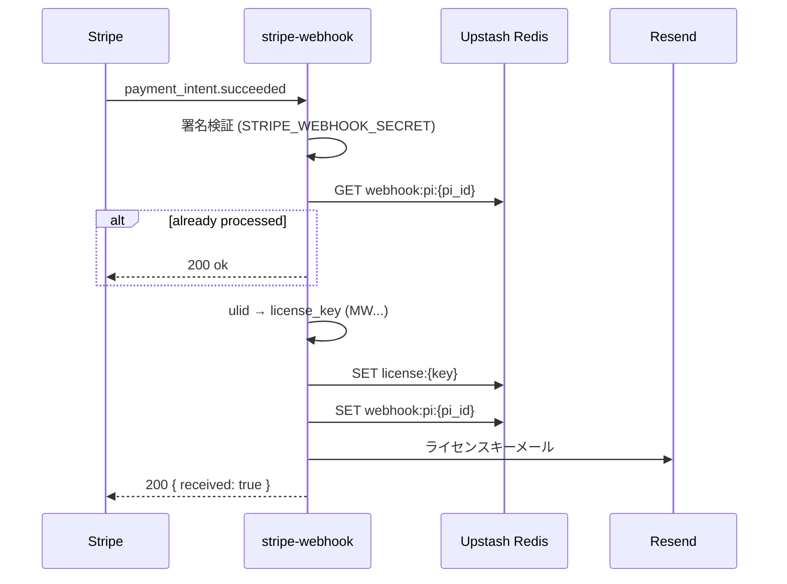

# Markwell API 仕様書 v1.0

> **対象プロジェクト**: `markwell-api`（Vercel 上の独立プロジェクト）  
> **作業ディレクトリ**: `/Users/yukikotaki/Documents/markwell-api/`  
> **拡張本体**: `/Users/yukikotaki/Documents/markwell/`（本作業では触らない）  
> **参照**: `markwell_spec_v1_0.md` §9（有料化）  
> **実装タイミング**: 次プロンプト（本書は実装指示書のみ）

---

## 1. 目的

Markwell Chrome 拡張の Premium ライセンスを、拡張本体とは分離したサーバーレス API で管理する。

- **購入フロー**: 拡張内 Stripe Payment Link → Stripe 決済 → Webhook でライセンスキー発行・メール送信
- **検証フロー**: 拡張がライセンスキーを POST → API が Upstash Redis を参照して有効性を返す

拡張側は既に `LICENSE_VERIFY_URL`（`src/shared/license/config.ts`）と `verifyLicenseKey()`（`src/shared/license/verify-license-key.ts`）の骨格がある。本 API 実装後、拡張は `device_id` 付きリクエストへ更新する（別タスク）。

---

## 2. 技術スタック

| 項目 | 選定 |
|------|------|
| フレームワーク | **Next.js 14**（App Router） |
| ホスティング | **Vercel**（プロジェクト名: `markwell-api`） |
| ライセンスストア | **Upstash Redis** |
| 決済 | **Stripe**（アカウント **`acct_1TXZCQRSXt15GdgT` のみ** — 他アカウント参照禁止） |
| メール | **Resend** |
| ライセンスキー ID | **ulid**（`ulid` パッケージ） |

### 2.1 やらないこと

- Stripe.js を API 側で使う必要はない（Payment Link は拡張から直接開く）
- 拡張プロジェクト `markwell` 内のコードは本フェーズでは変更しない
- Stripe アカウント `acct_1TXZCQRSXt15GdgT` 以外のキー・Webhook・Payment Link を参照しない

---

## 3. プロジェクト初期構成（次プロンプトで作成）

```text
markwell-api/
├── app/
│   └── api/
│       ├── verify-license/
│       │   └── route.ts          # POST 検証
│       └── stripe-webhook/
│           └── route.ts          # POST Stripe Webhook
├── lib/
│   ├── redis.ts                  # Upstash クライアント
│   ├── rate-limit.ts             # INCR ベースレート制限
│   ├── license.ts                # キー生成・Redis 読み書き
│   ├── stripe.ts                 # 署名検証・イベントパース
│   └── email.ts                  # Resend 送信
├── package.json
├── tsconfig.json
├── next.config.js
├── .env.example
└── README.md
```

```bash
# 次プロンプトでの初期化例
npx create-next-app@14 markwell-api --ts --app --eslint --no-src-dir
cd markwell-api
npm i @upstash/redis ulid stripe resend zod
```

---

## 4. 環境変数

| 変数名 | 用途 | 備考 |
|--------|------|------|
| `UPSTASH_REDIS_REST_URL` | Upstash Redis REST | Vercel 連携 or Upstash ダッシュボード |
| `UPSTASH_REDIS_REST_TOKEN` | Upstash Redis トークン | 同上 |
| `STRIPE_SECRET_KEY` | Stripe API | **acct_1TXZCQRSXt15GdgT** のシークレットキーのみ |
| `STRIPE_WEBHOOK_SECRET` | Webhook 署名検証 | `/api/stripe-webhook` 用 |
| `RESEND_API_KEY` | メール送信 | |
| `RESEND_FROM_EMAIL` | 送信元 | 例: `Markwell <licenses@markwell.app>` |
| `LICENSE_RATE_LIMIT_IP_PER_MIN` | IP 単位上限 | 既定: `30` |
| `LICENSE_RATE_LIMIT_KEY_PER_MIN` | license_key 単位上限 | 既定: `10` |

`.env.example` に上記を列挙し、実値は Vercel の Environment Variables に設定する。

---

## 5. Upstash Redis データモデル

### 5.1 ライセンスレコード

**キー**: `license:{license_key}`  
**型**: String（JSON）

```json
{
  "license_key": "MW01HXYZ...",
  "tier": "premium",
  "expires_at": null,
  "device_id": null,
  "stripe_payment_intent_id": "pi_xxx",
  "customer_email": "user@example.com",
  "created_at": 1716000000000,
  "revoked": false
}
```

| フィールド | 型 | 説明 |
|------------|-----|------|
| `license_key` | string | `MW` + ULID（大文字） |
| `tier` | `"premium"` | v1.0 では Premium 購入のみ |
| `expires_at` | number \| null | Unix ms。買い切りのため **null**（無期限） |
| `device_id` | string \| null | 最後に検証成功した `device_id`（任意・後述） |
| `stripe_payment_intent_id` | string | 冪等性・監査用 |
| `customer_email` | string | Resend 送信先 |
| `created_at` | number | Unix ms |
| `revoked` | boolean | 無効化フラグ（将来用、既定 false） |

### 5.2 冪等性キー（Webhook 重複防止）

**キー**: `webhook:pi:{payment_intent_id}`  
**値**: `license_key`  
**TTL**: 90 日

同一 `payment_intent.succeeded` の再送時、新規キーを発行しない。

### 5.3 レート制限カウンタ

**キー（IP）**: `ratelimit:verify:ip:{ip}:{yyyyMMddHHmm}`  
**キー（license_key）**: `ratelimit:verify:key:{license_key}:{yyyyMMddHHmm}`  
**操作**: `INCR` → 初回 `EXPIRE 120`  
**判定**: カウンタが上限超過なら `429 Too Many Requests`

---

## 6. `POST /api/verify-license`

### 6.1 概要

拡張が保存済みライセンスキーの有効性を確認する。

| 項目 | 値 |
|------|-----|
| メソッド | `POST` |
| パス | `/api/verify-license` |
| Content-Type | `application/json` |
| 認証 | なし（レート制限 + キー照合で保護） |

### 6.2 リクエスト

```typescript
{
  license_key: string;  // 必須。例: "MW01HXYZ..."
  device_id: string;    // 必須。拡張が生成する端末識別子（chrome.storage.local に永続化）
}
```

**バリデーション（zod）**

- `license_key`: 非空、最大 64 文字、`^MW[A-Z0-9]{20,}$` 程度（ULID 部分は実装時に調整可）
- `device_id`: 非空、最大 128 文字

### 6.3 レスポンス

#### 成功（200）

```typescript
{
  valid: true;
  tier: "premium";
  expires_at: number | null;  // null = 無期限
}
```

#### 無効キー（200 — 拡張の既存実装に合わせる）

拡張 `verify-license-key.ts` は `response.ok` と `payload.valid` を見る。無効時も **HTTP 200** で返し、`valid: false` とする（4xx だと拡張が一律「無効」扱いになるため、現行コードと整合）。

```typescript
{
  valid: false;
  tier?: never;
  expires_at?: never;
}
```

> **将来**: 拡張側を更新後、`404` / `403` の使い分けも検討可。v1.0 は上記に固定。

#### レート制限（429）

```typescript
{
  error: "rate_limit_exceeded";
  retry_after_seconds: number;
}
```

#### サーバーエラー（500）

```typescript
{
  error: "internal_error";
}
```

### 6.4 処理フロー



1. クライアント IP を取得（`x-forwarded-for` の先頭、Vercel 標準）
2. IP / `license_key` それぞれでレート制限チェック
3. `GET license:{license_key}` — 無ければ `{ valid: false }`
4. `revoked === true` なら `{ valid: false }`
5. `expires_at` が過去なら `{ valid: false }`（v1.0 は通常 null）
6. 成功時: `device_id` をレコードに保存（同一キーの端末紐付け・将来の台数制限用）
7. `{ valid: true, tier, expires_at }` を返す

### 6.5 CORS

Chrome 拡張の `fetch` は拡張オリジン（`chrome-extension://{extension_id}`）から来る。

`next.config.js` または Route Handler で以下を許可:

- `Access-Control-Allow-Origin`: `*`（v1.0）または許可リスト
- `Access-Control-Allow-Methods`: `POST, OPTIONS`
- `Access-Control-Allow-Headers`: `Content-Type`

`OPTIONS` プリフライトを `route.ts` で処理する。

### 6.6 拡張側との現状差分（別タスクで吸収）

| 項目 | 拡張現状 | API v1.0 |
|------|----------|----------|
| リクエスト body | `{ license_key }` のみ | `{ license_key, device_id }` 必須 |
| レスポンス | `{ valid, tier? }` | `{ valid, tier, expires_at }` |
| URL | `LICENSE_VERIFY_URL` プレースホルダー | デプロイ後の実 URL に差し替え（markwell-100 前後） |

---

## 7. `POST /api/stripe-webhook`

### 7.1 概要

Stripe からの Webhook を受信し、決済成功時にライセンスキーを発行してメール送信する。

| 項目 | 値 |
|------|-----|
| メソッド | `POST` |
| パス | `/api/stripe-webhook` |
| 本文 | Raw body（署名検証のため `request.text()` で取得） |

### 7.2 対象イベント

**v1.0 で処理するイベント**: `payment_intent.succeeded` のみ

他イベントは `200` で無視（ログのみ）。

### 7.3 処理フロー



1. `stripe.webhooks.constructEvent(rawBody, signature, STRIPE_WEBHOOK_SECRET)` で署名検証。失敗時 `400`
2. `event.type === 'payment_intent.succeeded'` 以外は `200` で終了
3. `payment_intent.id` で冪等性チェック
4. `payment_intent.receipt_email` または `charges.data[0].billing_details.email` から顧客メール取得。無ければログ + `200`（キーは発行するがメール失敗は別途監視）
5. `license_key = 'MW' + ulid().toUpperCase()` を生成
6. Redis にライセンスレコード保存
7. 冪等性キー保存
8. Resend でメール送信（件名・本文は §7.5）
9. `200 { received: true }`

### 7.4 Payment Link との接続

拡張の Payment Link（`DEFAULT_STRIPE_PAYMENT_LINK` / `Settings.stripe_payment_link`）は **acct_1TXZCQRSXt15GdgT** 上に作成する。

Stripe ダッシュボードで Webhook エンドポイントを登録:

- URL: `https://{markwell-api-domain}/api/stripe-webhook`
- イベント: `payment_intent.succeeded`

Payment Link 経由の決済でも `payment_intent.succeeded` が発火することを Stripe テストモードで確認してから本番化する。

### 7.5 Resend メールテンプレート

**件名**: `Markwell Premium ライセンスキー`

**本文（プレーンテキスト）**:

```text
Markwell Premium をご購入いただきありがとうございます。

ライセンスキー:
{license_key}

Markwell の Options → Premium に上記キーを貼り付け、「適用」を押してください。

このキーはお使いのブラウザに紐づけてご利用ください。
サポート: tabisurushosai+markwell@gmail.com
```

---

## 8. レート制限実装詳細

`lib/rate-limit.ts` の想定 API:

```typescript
type RateLimitResult =
  | { allowed: true }
  | { allowed: false; retryAfterSeconds: number };

async function checkVerifyRateLimit(params: {
  ip: string;
  licenseKey: string;
}): Promise<RateLimitResult>;
```

**アルゴリズム（各次元独立）**:

1. 分単位バケット: `floor(now / 60000)` または `yyyyMMddHHmm` 文字列
2. `INCR ratelimit:verify:ip:{ip}:{bucket}`
3. 戻り値が `1` なら `EXPIRE key 120`
4. カウント > `LICENSE_RATE_LIMIT_IP_PER_MIN` なら拒否
5. `license_key` についても同様

拒否時 `Retry-After` ヘッダーを付与（秒）。

---

## 9. ファイル別実装指示（次プロンプト）

### 9.1 `app/api/verify-license/route.ts`

- `export const runtime = 'edge'` は **使わない**（Node.js runtime 既定で Upstash / Stripe 互換を優先）
- `POST` ハンドラのみ + `OPTIONS`
- zod で body パース
- 上記フローどおり Redis 参照
- 構造化ログ（`license_key` は末尾 4 文字のみマスク）

### 9.2 `app/api/stripe-webhook/route.ts`

- **raw body 必須**: `export const dynamic = 'force-dynamic'`
- Next.js 14 では `request.text()` を署名検証前に一度だけ読む
- 例外は握りつぶさず Sentry 等は将来追加。v1.0 は `console.error`

### 9.3 `lib/license.ts`

- `createLicenseRecord(paymentIntent): LicenseRecord`
- `getLicense(licenseKey): LicenseRecord | null`
- `touchDeviceId(licenseKey, deviceId): void`

### 9.4 `lib/redis.ts`

- `@upstash/redis` のシングルトン

---

## 10. テスト計画（次プロンプト以降）

| 種別 | 内容 |
|------|------|
| 単体 | `createLicenseKey()` 形式、`checkVerifyRateLimit` 上限 |
| 統合 | Upstash モック or 開発用 DB で verify 成功/失敗 |
| 手動 | Stripe CLI `stripe listen --forward-to localhost:3000/api/stripe-webhook` |
| 手動 | テスト決済 → メール受信 → 拡張で適用（拡張接続は別タスク） |

```bash
# Stripe CLI 例
stripe trigger payment_intent.succeeded
```

---

## 11. デプロイ

1. GitHub リポジトリ `markwell-api` を作成（拡張 `markwell` とは別リポ）
2. Vercel にインポート、プロジェクト名 `markwell-api`
3. 環境変数を Production / Preview に設定
4. デプロイ URL を控える（例: `https://markwell-api.vercel.app`）
5. 拡張 `LICENSE_VERIFY_URL` を `https://{domain}/api/verify-license` に更新（**markwell-100 前後・別タスク**）

---

## 12. セキュリティチェックリスト

- [ ] Stripe Webhook 署名を必ず検証
- [ ] `STRIPE_SECRET_KEY` をクライアント・拡張に露出しない
- [ ] Redis トークンをサーバー環境変数のみに保持
- [ ] verify-license にレート制限（IP + key）
- [ ] ログにフル `license_key` を出さない
- [ ] Stripe アカウントが `acct_1TXZCQRSXt15GdgT` であることをデプロイ前に確認

---

## 13. バージョン履歴

| 版 | 日付 | 内容 |
|----|------|------|
| 1.0 | 2026-05-18 | 初版。verify-license / stripe-webhook / Redis / レート制限の実装指示 |
